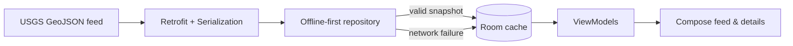

# CrisisProtect

[](https://www.android.com/)
[](https://kotlinlang.org/)
[](https://developer.android.com/jetpack/compose)
[](https://developer.android.com/about/versions/nougat)

An offline-first Android earthquake feed. CrisisProtect fetches the USGS M2.5+ past-day feed, stores valid events locally, and keeps cached information available when the network fails.

## Stack

- Kotlin, Jetpack Compose, Material 3, Navigation Compose
- Retrofit + OkHttp + Kotlin Serialization
- Room, Coroutines/Flow, Koin
- R8 optimization for release builds

## Data flow



## Build

```bash
./gradlew assembleDebug
./gradlew testDebugUnitTest
```

The production feed is the public [USGS Earthquake GeoJSON summary](https://earthquake.usgs.gov/earthquakes/feed/v1.0/geojson.php); it requires no API key.

